# AGENTS.md

## Repository overview

Collection of self-hosted Docker services, each in its own directory with a `docker-compose.yml` and `makefile`. The `ozarr/` subdirectory contains a TypeScript automation project using Effect.

## Traefik (reverse proxy)

- All services share the `traefik` external Docker network
- `make init` in the repo root creates the `traefik` network; `make traefikup` starts Traefik + Pangolin + Gerbil
- Start Traefik before any other service

## Root makefile targets

Each service has `<name>up`, `<name>down` targets (e.g. `make ozarrup`, `make traefikup`). `make allup` / `make alldown` manage the full stack.

## ozarr (TypeScript automation)

Runtime: **Bun** (no tsconfig, no linter, no formatter, no test framework).

Framework: **Effect** v4 beta (`effect`, `@effect/platform-bun`, `@effect/sql-sqlite-node`, `tsarr`).

### Key scripts

| Command | Purpose |
|---------|---------|
| `bun setup.ts` | Full setup automation (dirs, qBittorrent config, start containers, configure Sonarr/Radarr/Prowlarr/Homarr/Seerr/Jellyfin) |
| `bun backup.ts` | Backup *arr configs via API (Sonarr/Radarr/Prowlarr) + file-level Seerr backup |


Use `bun setup.ts --service <name>` or `bun backup.ts -s <name>` to target a single service.

### ozarr makefile

```
make up        # docker compose up -d
make down      # docker compose down
make log       # docker compose logs -f
make setup     # bun setup.ts
make backup    # bun backup.ts
```

### Architecture

- **Cross-seed**: qui in hardlink mode. Services that need hardlinks (qBittorrent, qui, Sonarr, Radarr, Cleanuparr) all mount `./data:/data` so downloads, cross-seed, and media share one filesystem.
- **API keys**: extracted from service config XML files at runtime, stored in `.env`. Setup populates `.env` automatically where possible.
- **Permissions**: `PUID=1000`, `PGID=1000`, `UMASK=002` (rootless Seerr uses `node:node` 1000:1000).
- **Git-ignored**: `*/config/`, `*/data`, `.env`, `node_modules/`.

### Important constraints from `.opencode.json`

References external repos for context, enabled via `opencode.json`:
- `servarr` — Servarr Wiki (Docker setup guidance)
- `ezarr` — alternative arr Docker setup reference
- `effect` — Effect framework patterns (effect-smol)
- `effect-accountability` — real-world Effect usage

These are loaded as reference repos when OpenCode tasks involve those topics.

### Maintainerr rules

Rules for maintainerr are located in `maintainerr_rules`.

- Glossary documentation: https://raw.githubusercontent.com/Maintainerr/Maintainerr_docs/refs/heads/main/docs/Glossary.md
- Rules documentation: https://raw.githubusercontent.com/Maintainerr/Maintainerr_docs/refs/heads/main/docs/Rules.mdx

The glossary is a single large Markdown file where each top-level section starts with a `###` heading.

When you need information about a specific application:

1. Download `Glossary.md` into a temporary directory.
2. Run: `grep -n "^### " Glossary.md`
3. Find the line number of the requested section.
4. Read from that line until (but not including) the next `###` heading.
5. If there is no following `###` heading, read until the end of the file.

Example:

```
13:### Plex
544:### Jellyfin
1075:### Radarr
1365:### Sonarr
1763:### Seerr
```

If the requested section is **Radarr**, read lines **1075–1364** (starting at `### Radarr` and stopping just before `### Sonarr` on line 1365).

### Service interaction diagram

```mermaid
graph TB
  subgraph Ingress["Ingress"]
    Gerbil["Gerbil:443"] --> Traefik["Traefik (reverse proxy)"]
    Pangolin["Pangolin:3001"] --> Gerbil
  end

  subgraph traefik_network["traefik external network"]
    subgraph hardlink_group["Shared /data:/data (hardlinks)"]
      qbt["qBittorrent:8888"]
      qui["qui (cross-seed):7476"]
      qm["qbit_manage:8181"]
      sonarr["Sonarr:8989"]
      radarr["Radarr:7878"]
    end

    jellyfin["Jellyfin:8096\n/data/media only"]
    homarr["Homarr:7575"]
    seerr["Seerr:5055"]
    prowlarr["Prowlarr:9696"]
    flaresolverr["FlareSolverr:8191"]
    wizarr["Wizarr:5690"]
    profilarr["Profilarr:6868"]
    parser["Parser:5000"]
    maintainerr["Maintainerr:6246"]
  end

  Traefik --> qbt
  Traefik --> sonarr
  Traefik --> radarr
  Traefik --> jellyfin
  Traefik --> homarr
  Traefik --> seerr
  Traefik --> prowlarr
  Traefik --> wizarr
  Traefik --> profilarr
  Traefik --> maintainerr
  Traefik --> qui
  Traefik --> qm

  sonarr -. "download client (Docker DNS)" .-> qbt
  radarr -. "download client (Docker DNS)" .-> qbt
  qui -. "API (Docker DNS)" .-> qbt
  qm -. "API + config (read-only)" .-> qbt

  prowlarr -. "indexer sync (Docker DNS)" .-> sonarr
  prowlarr -. "indexer sync (Docker DNS)" .-> radarr
  prowlarr -. "proxy (Docker DNS)" .-> flaresolverr

  seerr -. "media requests (Docker DNS)" .-> sonarr
  seerr -. "media requests (Docker DNS)" .-> radarr
  seerr -. "media availability (Docker DNS)" .-> jellyfin

  wizarr -. "user onboarding (Docker DNS)" .-> jellyfin

  profilarr -. "quality profiles (Docker DNS)" .-> parser

  homarr -. "status ping (Docker DNS)" .-> jellyfin
  homarr -. "status ping (Docker DNS)" .-> sonarr
  homarr -. "status ping (Docker DNS)" .-> radarr
  homarr -. "status ping (Docker DNS)" .-> prowlarr
  homarr -. "status ping (Docker DNS)" .-> qbt
  homarr -. "status ping (Docker DNS)" .-> seerr

  %% Dependencies
  seerr -. "depends_on (healthy)" .-> qbt
  seerr -. "depends_on (healthy)" .-> sonarr
  seerr -. "depends_on (healthy)" .-> radarr
  seerr -. "depends_on (healthy)" .-> jellyfin
  prowlarr -. "depends_on (healthy)" .-> qbt
  prowlarr -. "depends_on (healthy)" .-> sonarr
  prowlarr -. "depends_on (healthy)" .-> radarr
  prowlarr -. "depends_on (healthy)" .-> jellyfin
  wizarr -. "depends_on (healthy)" .-> qbt
  wizarr -. "depends_on (healthy)" .-> sonarr
  wizarr -. "depends_on (healthy)" .-> radarr
  wizarr -. "depends_on (healthy)" .-> jellyfin
  profilarr -. "depends_on (healthy)" .-> parser
  profilarr -. "depends_on (healthy)" .-> qbt
  profilarr -. "depends_on (healthy)" .-> sonarr
  profilarr -. "depends_on (healthy)" .-> radarr
  profilarr -. "depends_on (healthy)" .-> jellyfin
  qui -. "depends_on (healthy)" .-> qbt
  qm -. "depends_on (healthy)" .-> qbt
```



**Legend:**
- Solid arrows: reverse proxy routing (Traefik)
- Dotted arrows: inter-service API communication (Docker DNS)
- Dependencies (`depends_on`) are shown with `.->` connecting lines
